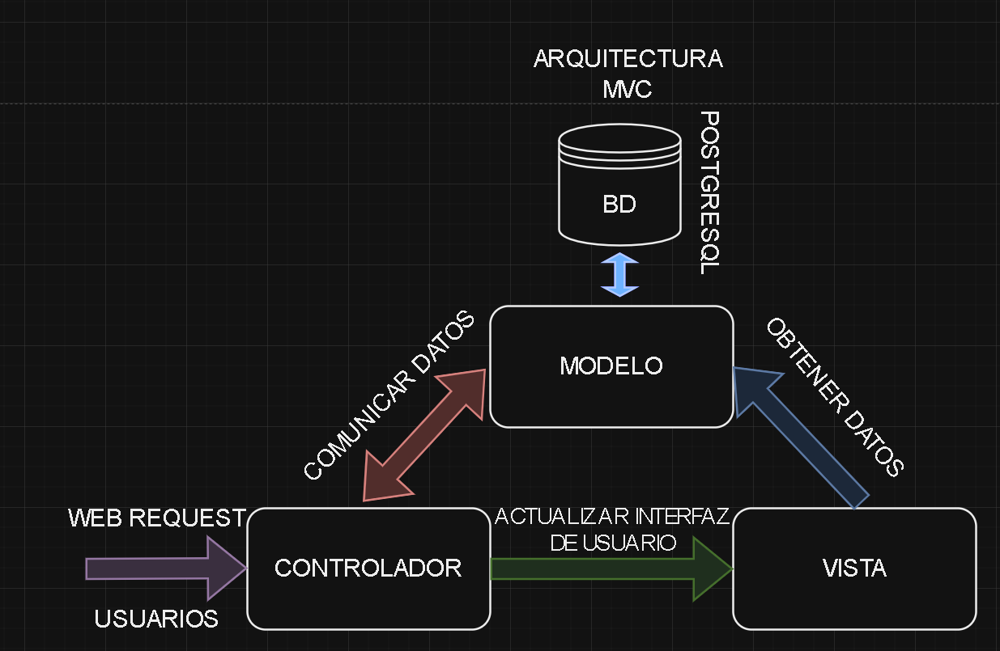
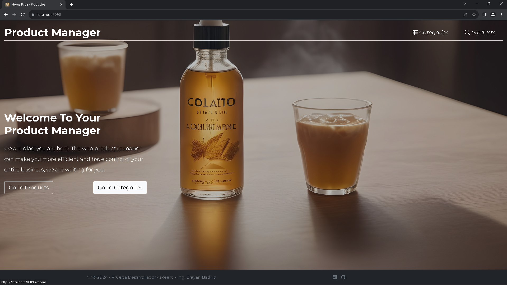
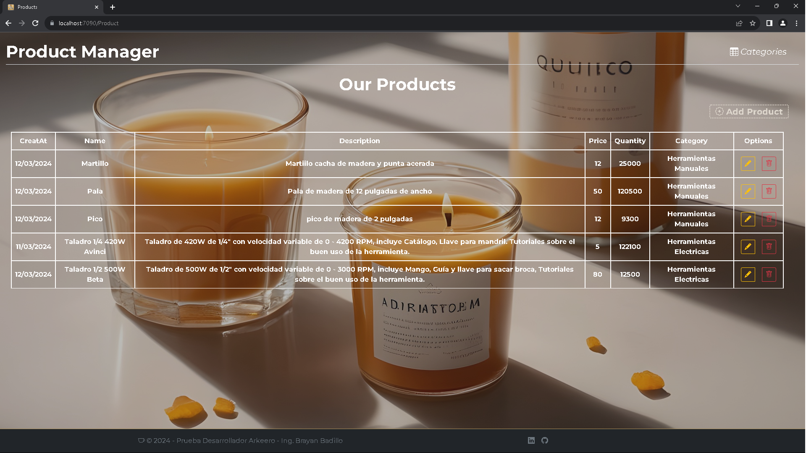
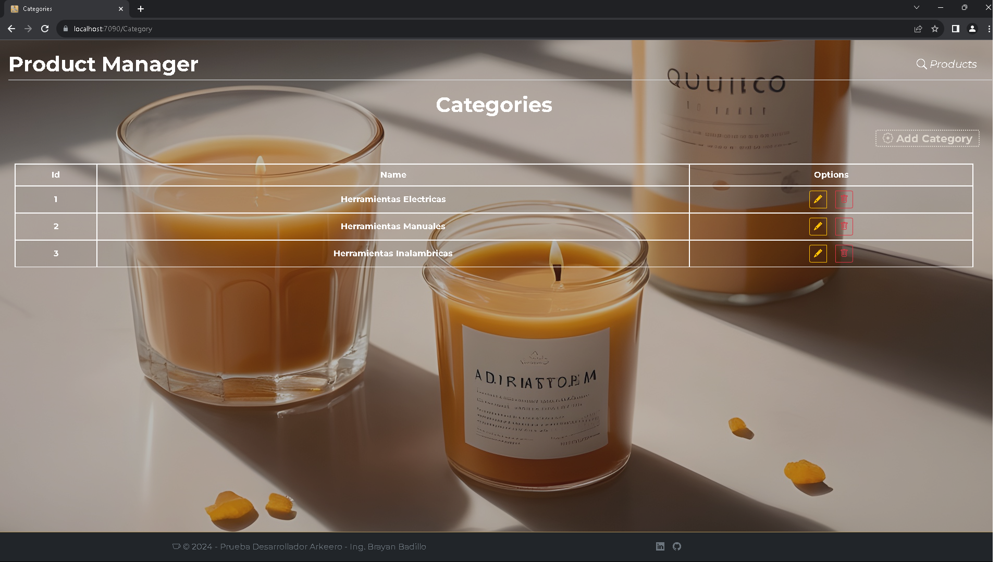

# Prueba técnica para Desarrollador .NET ARKEERO

### Autor: Brayan Badillo Diaz
#### Esp. Ingenieria de Software | Ing. Electronico

## Sección 1: Desarrollo de Código

### Aplicacion MVC
___Se implementa una Arquitectura Hexagonal en una aplicacion MVC___




Se desarrolla la aplicacion MVC con una arquitectura hexagonal para tener menor acoplamiento en la aplicacion debido a la separacion de responsabilidades, ademas esta arquitectura podemos agregar servicios externos, podemos crear o cambiar adaptadores, facilidad para testear la aplicacion, flexibilidad, escalabilidad y mantenibilidad de la aplicacion.

### Creacion de la base de datos
```
1. Abrir proyecto en Visual Studio 2022
2. Abrir el Archivo AppSettings.
4. Cambiar la configuracion de la conexion de la base de datos a la necesaria para probar la aplicacion
5. Abrir la consola de paquetes nugets
6. Ejecutar el siguiente comando:
	        Update-Database
7. Si todo sale correctamente proceda a ejecutar la aplicacion.
```

### Estructura del proyecto
```
Productos/
  |- Controllers/
  |   |- HomeController.cs
  |   |- ProductController.cs
  |   |- CategoryController.cs
  |- Views/
  |   |- Home/
  |   |- Home/
  |   |- Product/
  |   |- Shared/
  |- Program.cs

Productos.Application
|- AutoMapperProfiles/
|  |- CategoryProfile.cs
|  |- ProductProfile.cs
|- Features/
|  |- Categories/
|  |   |- Commands/
|  |   |- Queries/
|  |- Products/
|  |   |- Commands/
|  |   |- Queries/

Productos.Domain
|- Dtos/
|- Ports/
|- Services/

Productos.Domain
|- Dtos/
|- Entities/
|- Ports/
|- Services/

Productos.Infraestructure
|- Adapters/
|   |- CategoryRepository.cs
|   |- GenericRepository.cs
|   |- ProductRepository.cs
|   |- UnitOfWorkRepository.cs
|- Data/
|-  |- ApplicationDbContext.cs
|- Migrations/
```

Como observamos la estructura del proyecto observamos los 4 proyectos en los cuales tenemos ***productos*** que es el _front del proyecto_, ***Application*** que es donde implementamos _AutoMapper_ y tenemos implementado el _patron CQRS y MediatR_, en *Domain* tenemos _las entidades de la capa de negocio, los ***DTOS***, Ports que son las ***interfaces*** donde aplicamos el ***patron Repository y UnitOfWork*** y implementamos un ***repositorio Generico***_ ademas tenemos _Services que es donde implementamos los servicios con ***UnitOfWork***_ en ***Infraestructura*** tenemos todo lo relacionado con la _persistencia de datos y la implementacion del repositorio generico para cada entidad_, ademas tenemos la clase _dbContext y implementamos datos semillas._

En la realizacion de la aplicacion se aplico estilos con Boostrap 5  y se realizo todas las acciones del CRUD para productos y categorias mediante Vanilla JavaScript,ademas se utiliza SweetAlert para mostrar alertas y mensajes de confirmacion para las diferentes acciones.

## ScreenShots de la aplicacion

### Inicio de la aplicacion


### Seccion Productos


### Seccion Categorias


como se puede observar en la pagina principal podremos navegar desde las opciones en el Navbar Categories y Products o desde los botones que estan en la seccion donde esta la bienvenida de la pagina los acuales son Go To Products y Go To Categories.

Dentro de las seccion Products nos mostra una tabla con los productos creados con sus respectivas opciones de editar y eliminar producto, ademas tenemos la opcion de agregar producto en el boton encima de la tabla con el texto Add Product, ademas se podra navegar a Categories desde la opcion en el Navbar o volver al inicio dando clic en el texto Producto Manager.

Dentro de las seccion Categories nos mostra una tabla con las categorias creados con sus respectivas opciones de editar y eliminar categoria, ademas tenemos la opcion de agregar categoria en el boton encima de la tabla con el texto Add Category, ademas se podra navegar a Products desde la opcion en el Navbar o volver al inicio dando clic en el texto Producto Manager.
